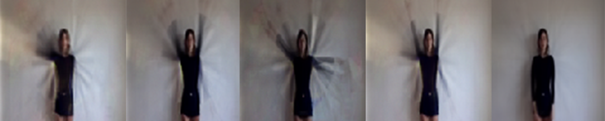

# Neural Dream Videos

A deep learning method for creating video sequences

This repository includes a method for creating what I like to call Neural Dream Videos, which are a way of generating new videos
with the same temorpal and spatial qualities as a source video. It uses a variational autoencoder and recurrent neural
network in conjunction in order to produce the videos. To see example videos and learn more, see my [Medium post](https://medium.com/p/5d517b3cc804)
about it.

Included in the repository is an ipython notebook which contains most of the information needed to make your own videos.
The neural network architectures are written in Tensorflow, and you will likely need at least version 0.8.

The VAE is based on the model by [Jan Hendrik Metzen](https://jmetzen.github.io/2015-11-27/vae.html).

The RNN is heavily modified from  the model by [sherjilozair](https://github.com/sherjilozair/char-rnn-tensorflow).
